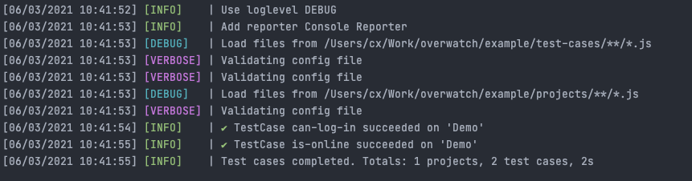

# ui-overwatch
`ui-overwatch` is a tool, which should help to keep the functionality
of your UI/Application across instances working. This comes in handy,
if you have the same application running on several instances.

With overwatch, you configure a project, and define test scenarios.
Those test scenarios will run against every project configured and alarm you
if some tests fail.

Those test scenarios are executed using [playwright](https://playwright.dev/).

## How To
Check out the `example` folder for project and test case configuration.

```js
import { addReporter, datadogReporter, slackReporter, overwatch } from 'ui-overwatch';

addReporter( slackReporter( process.env.SLACK_WEBHOOK_URL ) );
addReporter( datadogReporter( process.env.DD_CLIENT_API_KEY ) );

overwatch( [], './projects/**/*.js', './test-cases/**/*.js');
```

__CLI Output__


